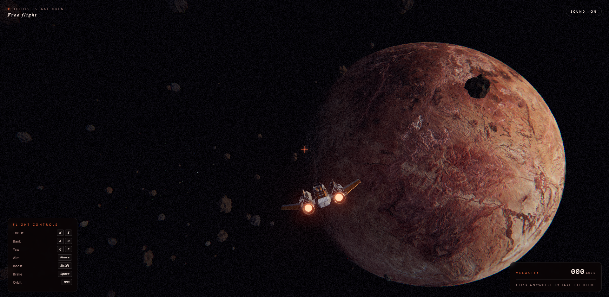

# Helios — The Cosmic Stage

A WebGL space scene you can fly through. Pilot a ship past nebulae, planets, and asteroid fields with ambient audio and a reactive engine soundtrack.



**[Live demo](#)** · open `index.html` in a modern browser (or serve the folder over HTTP).

## Tech

- **Three.js** `0.160.1` — WebGL renderer, GLTF models, scene graph
- **GLSL shaders** — custom nebula, suns, particles, streaks, filaments, orb, ship
- **Post-processing** — `EffectComposer` with `UnrealBloomPass` + custom color grade
- **Web Audio API** — ambient track + procedural engine audio driven by throttle/velocity
- **Pure ES modules** via `<script type="importmap">` — no build step, no bundler

## Run locally

No install required. Just serve the directory:

```bash
# any static server works
npx serve .
# or
python -m http.server 8000
```

Then open `http://localhost:8000`.

## Controls

- **Mouse** — aim / look
- **W / S** — throttle
- **A / D** — roll
- **Scroll** — zoom
- **Space / Shift** — vertical

## Structure

```
index.html              entry + importmap + UI
src/main.js             bootstrap, render loop, system wiring
src/controls.js         ship input + camera rig
src/ship.js             ship model + dynamics
src/engineAudio.js      reactive engine audio
src/audio.js            ambient audio
src/nebula.js           volumetric nebula
src/planets.js          planets
src/asteroids.js        asteroid field
src/particles.js        starfield particles
src/phoenix.js          phoenix planet GLTF
src/trail.js            ship trails
src/streaks.js          speed streaks overlay
src/postfx.js           bloom + grade
src/shaders/            GLSL for each system
src/models/             GLTF assets (see per-model license.txt)
```

## Credits

GLTF models are third-party — license terms are in each model folder under `src/models/*/license.txt`.
